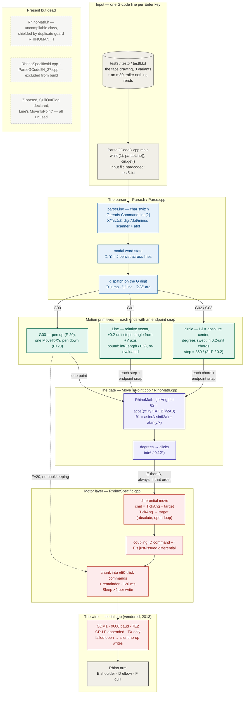
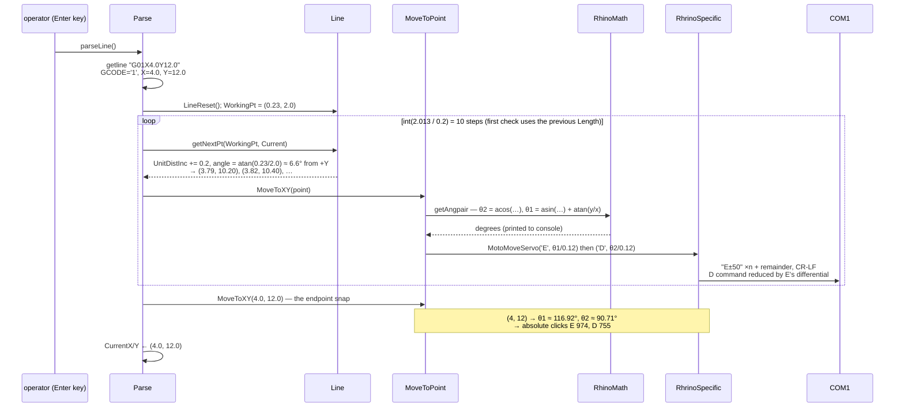

# Robotic Arm Drawing System — system design

> How a line of G-code becomes a pen stroke, one 0.2-unit step at a time.
>
> A command like `G01X4.0Y12.0` is read character by character, turned into a
> chain of Cartesian points 0.2 units apart, and each point is pushed through
> the same narrow gate: **two-link inverse kinematics** over two 9-unit arms,
> degrees quantized to **0.12° encoder clicks**, and a **differential motor
> command** — the difference between where each joint is remembered to be and
> where it must go, with the elbow's command corrected by the shoulder's move.
> What leaves the program is a stream of short serial commands —
> `E-50`, `D+19` — pacing a Rhino educational arm over COM1 at 9600 baud, 7E2.
> Every primitive ends with an unconditional snap to the exact target, which
> is the real reason the drawings close.

This document is the developer-facing map of the whole system — every component
and how data moves between them. The companion [README](README.md) covers the
per-layer detail, building, and running.

---

## End-to-end flowchart



**Legend** — ⬜ input / hardware · 🟦 parser · 🟩 motion primitives ·
🟪 IK gate · 🟥 motor layer & wire · ◌ dashed = present but dead
(the shielded header, the excluded files, the unused state).

---

## How to read it: the three ideas that matter

1. **Position state is layered, and every layer dead-reckons its own copy.**
   `Parse` holds the Cartesian pen position (twice, in fact: `CurrentX`/`CurrentY`
   and a `Current` struct); `Line` holds `UnitDistInc`, its progress along the
   current segment; `RhrinoSpecific` holds the arm's absolute pose in clicks
   (`TickAng1`/`TickAng2`). Nothing ever flows back up — the arm is never
   queried, the serial receive path is never used. Correctness at power-on
   rests on a three-way agreement between the seeds: Cartesian (9, 9) solves
   to exactly 90°/90°, which is exactly the 750/750 clicks the motor layer is
   born with. The one crack: `Parse`'s duplicate `Current` struct is seeded
   (0, 0), so a program whose *first* stroke is a `G01` — [test6.txt](test6.txt)
   is one — interpolates its first segment from the wrong origin until the
   endpoint snap corrects it.

2. **Absolute in, differential out.** Everything above the motor layer speaks
   absolute targets — Cartesian points, then absolute joint angles, then
   absolute click counts. `MotoMoveServo` is where absolute becomes relative:
   the command sent is `TickAng − target`, the new absolute is stored, and the
   elbow's command additionally subtracts the shoulder's just-issued
   differential — the correction you need when the joints' drives are
   mechanically coupled, and the reason `MoveToXY` must always send `E`
   immediately before `D` (the coupling reads state left behind by the
   previous call). The move then leaves as `±50`-click chunks plus a
   remainder, each write bracketed by 120 ms sleeps — pacing by delay, not by
   handshake.

3. **The endpoint snap is the real contract.** Every primitive — jump, line,
   arc — ends with an unconditional `MoveToXY` straight to the exact target.
   That single call is what the system actually guarantees; the interpolation
   in between only shapes the path. This is why several latent geometry bugs
   (the stale first loop bound, the leftward-horizontal walk, the vanishing
   CW arc) degrade drawings instead of breaking them: the pen always *arrives*,
   and `Parse`'s bookkeeping is updated from the target, not from the steps.
   It's also why the program is honest without hardware — if COM1 fails to
   open, every write silently no-ops and the console trace (parsed words,
   interpolated points, IK angles) becomes a full dry-run simulator.

---

## Deep dive 1 — one G01 line, end to end

Line 9 of [test5.txt](test5.txt) is `G01X4.0Y12.0`, arriving with the pen at
(3.77, 10.0) — the left ear stroke of the face:



Things worth noticing:

- **The loop bound heals itself.** `getLineSteps(0.2)` divides a `Length`
  member that is only recomputed inside `getNextPt`, so the *first* loop-entry
  check uses whatever the previous segment left behind (the constructor's 1.0
  here, since this is the file's first `G01`). From iteration one onward the
  bound is the true `int(2.013 / 0.2) = 10`.
- **Each interpolated point costs at least ~480 ms of sleep** — two motors,
  each write bracketed by 120 ms `Sleep`s — before any bytes move. Ten steps
  plus a snap make this one stroke a multi-second affair by design.
- **The IK trace is the observable output.** `getAngpair` prints both angles
  on every call; with the arm unplugged this sequence is exactly what you see,
  minus the serial writes.

## Deep dive 2 — the differential tick pipeline

The first move from home to (4, 12), worked through
[RhrinoSpecific::MotoMoveServo](RhrinoSpecific.cpp)'s arithmetic:

```text
  MoveToXY(4.0, 12.0)
       │  IK: θ1 = 116.92°, θ2 = 90.71°        (degrees)
       ▼
  int(θ / 0.12°)   →   E: 974 clicks    D: 755 clicks   (absolute pose)
       │
       ▼
 ┌─ RhrinoSpecific — remembered state: TickAng1 = 750, TickAng2 = 750 ─┐
 │                                                                     │
 │  'E':  diff = 750 − 974 = −224      TickAng1 ← 974                  │
 │        EmotorDistance = −224        command distance = −224         │
 │                                                                     │
 │  'D':  diff = 750 − 755 = −5        TickAng2 ← 755                  │
 │        command distance = −5 − (−224) = +219      ← the coupling    │
 └─────────────────────────────────────────────────────────────────────┘
       │  chunk: |d| / 50 full commands + remainder, direction from sign
       ▼
  "E-50" ×4, "E-24"      then      "D+50" ×4, "D+19"
  each CR-LF terminated · Sleep(120) before and after every write
```

- **`TickAng` stores the absolute, sends the difference.** After this move the
  layer remembers 974/755; the next target is diffed against that. The arm is
  trusted to have executed everything — pure open-loop dead reckoning.
- **The coupling is stateful and order-dependent.** `EmotorDistance2` is
  refreshed after *every* call's E-block, so the D calculation reads the E
  differential from the immediately preceding call. `MoveToXY`'s fixed
  E-then-D order is load-bearing; a standalone D move would subtract a stale
  shoulder differential.
- **The quill skips all of it.** `F` moves fall through both branches:
  `F-20` / `F+20` go out as-is, relative every time, no remembered state.

---

## Component inventory

| Component | Layer | Provenance | Where |
|---|---|---|---|
| Driver `main` — Enter-per-line stepper, hardcoded `test5.txt` | Input | project code | [ParseGCodeD.cpp](ParseGCodeD.cpp) |
| `Parse` — char-switch parser, modal words, G dispatch | Parser | scaffolding skeleton, filled in here | [Parse.h](Parse.h) / [Parse.cpp](Parse.cpp) |
| `Line` — 0.2-unit linear interpolation | Geometry | ✅ the marked student piece ("add your line code") | [Line.h](Line.h) / [Line.cpp](Line.cpp) |
| `circle` — degree-swept arc interpolation | Geometry | instructor demo code ("converted to degrees for demonstration") | [CircleC.h](CircleC.h) / [CircleC.cpp](CircleC.cpp) |
| `MoveToPoint` — the IK gate, E-then-D ordering | Gate | project code | [MoveToPoint.h](MoveToPoint.h) / [MoveToPoint.cpp](MoveToPoint.cpp) |
| `RhinoMath` — two-link IK, degree output | Kinematics | project code | [RhinoMan.h](RhinoMan.h) / [RinoMath.cpp](RinoMath.cpp) |
| `RhrinoSpecific` — differential ticks, coupling, chunked commands | Motor | demo scaffolding + in-class rework ("Prof and Rebecca") | [RhrinoSpecific.h](RhrinoSpecific.h) / [RhrinoSpecific.cpp](RhrinoSpecific.cpp) |
| `Tserial` — Win32 serial wrapper, TX-only in practice | Wire | third-party, vendored (header dated 2013) | [tserial.h](tserial.h) / [tserial.cpp](tserial.cpp) |
| Face drawings ×3 | Test data | project code | [test3.txt](test3.txt) / [test5.txt](test5.txt) / [test6.txt](test6.txt) |
| Build — VS 2019, v142, Win32 + x64, console | Build | Visual Studio template | [ParseGCodeE4_27.sln](ParseGCodeE4_27.sln) / [.vcxproj](ParseGCodeE4_27.vcxproj) |
| `MasterHeader` class declaration | — | ⬜ dead header, shielded by duplicate include guard | [RhinoMath.h](RhinoMath.h) |
| Older motor layer with debug trace | — | ⬜ superseded, excluded from build | [RhrinoSpecificold.cpp](RhrinoSpecificold.cpp) |
| Template "Hello World" `main` | — | ⬜ stub, excluded from build | [ParseGCodeE4_27.cpp](ParseGCodeE4_27.cpp) |
| Parser-source snapshot dated 2022-04-26 | — | ⬜ archive | [ParseGCodeE4_27.zip](ParseGCodeE4_27.zip) |

---

## The numbers that matter

| Value | What it is |
|---|---|
| 9.0 / 9.0 | link lengths `ArmA` / `ArmB` — `RhinoMath` constructor defaults |
| 0.12° | one encoder click; `MoveToXY` divides degrees by `.12` |
| 750 / 750 | `TickAng1` / `TickAng2` seeds — "clicks to get from 0° to 90°" |
| (9, 9) | `Parse`'s Cartesian home — solves to exactly 90°/90° = 750/750 clicks, closing the three-way seed agreement |
| 0.2 | the interpolation quantum: units per line step and per arc chord — a literal at both call sites |
| 360 / (2πR / 0.2) | degrees per arc step, derived from radius so chords stay 0.2 units |
| 50 | maximum clicks per serial command; moves chunked into `±50`s + remainder |
| ±20 | quill (`F`) clicks: −20 pen up, +20 pen down — always relative |
| 120 ms | `Sleep` before *and* after every serial write (~480 ms floor per interpolated point; the old motor layer used 250 ms) |
| 9600 · 7E2 | COM1 configuration: `BaudRate` 9600, `ByteSize` 7, `EVENPARITY`, `TWOSTOPBITS` — not the 8N1 the old README claimed |
| 80 | max characters per G-code line (`getline` buffer) — and, coincidentally, the `RobCmd` buffer |
| `CommandLine[2]` | where the G digit is read from — zero-padded two-digit codes only |
| `'8'` | the stop sentinel (third char of a G line); the `m80` trailer never matches it |
| 3 / 0 | sample drawings / automated tests |

---

## Verification status

There are **no automated tests** — no unit tests, no harness, no asserts. The
code was validated the way classroom robot code usually is, and the repo shows
its work:

- **The driver is the debugger.** `while(1) { parseLine(); cin.get(); }`
  single-steps the program one G-code line per Enter, and every layer prints:
  the parser echoes `G0# X… Y… I… J…`, the line loop prints each interpolated
  point, and the IK prints both joint angles per solve. `circle` still carries
  a `test` variable kept "for break point to be removed".
- **Dry-run by default.** With no arm on COM1 the failed connect leaves an
  invalid handle and every write silently no-ops, so the full pipeline runs as
  a console trace on any Windows machine.
- **Hardware runs happened but aren't captured here** — the in-class comments
  ("work explained in class with Prof and Rebecca", tuning notes like
  "Needs to be 1 for line but 50 for point-to-point") are the surviving
  evidence of iteration against the physical arm.
- What the three test files *don't* cover is exactly where the latent bugs
  live: no leftward-horizontal `G01`, no CCW arc with start angle below end
  angle, no CW arc crossing 0°, no out-of-reach target.

---

## Design trade-offs & sharp edges

- **Open-loop dead reckoning over feedback** — the serial receive path exists
  in `Tserial` but is never called; the arm is never asked where it is. Cheap
  and simple, but any lost command desynchronizes `TickAng` from reality until
  restart re-seeds home.
- **The endpoint snap over correct interpolation** — the unconditional final
  `MoveToXY` converts geometry bugs into path-quality bugs. It is why the
  stale first loop bound, the leftward-horizontal walk (ΔY = 0, ΔX < 0 steps
  *away* from the target), and the vanishing CW-across-0° arc all still
  produce closed drawings.
- **Degrees end to end** — every angle is converted to degrees at birth
  ("for demonstration", per the comments) and back to radians inside each
  trig call. Readable in the console, wasteful in the math, and the reason
  the arc sweep logic can use `+360` bookkeeping — which is also where the
  CCW extra-lap bug lives (`G03` with start < end draws a full pen-down
  revolution).
- **An absolute-center `I,J` dialect** — `circle` subtracts `(I, J)` from both
  endpoints, so the files encode arc centers absolutely, not as the standard
  offsets-from-start. The test files and the parser agree with each other and
  disagree with vanilla G-code; feeding this interpreter real CNC output would
  draw the wrong arcs. (`Parse` then reconstructs the current position as
  `Target + Center` — correct only because `DoitC` mutates its by-reference
  arguments first. Fragile, but verified.)
- **Sleep-paced serial over handshake** — flow control disabled, timeouts
  zeroed, 120 ms sleeps bracketing every write. Robust against nothing,
  but simple, and the ~480 ms-per-point floor doubles as the arm's settling
  time.
- **Stateful coupling over stateless commands** — the elbow correction reads
  the shoulder differential left by the previous call, hard-wiring the
  E-then-D calling convention into correctness. Refactor `MoveToXY`'s two
  lines apart and the arm draws garbage.
- **Two integration styles side by side** — `circle` drives the arm itself
  through an injected `MoveToPoint*`; `Line` hands points back and lets
  `Parse` drive. `Line` also has an injected pointer — never set, never used.
  The asymmetry is the visible seam between provided demo code and the
  student-built primitive.
- **One bug shielding another** — [RhinoMath.h](RhinoMath.h) cannot compile
  (nonexistent `AngPair` type), but its copy-pasted `RHINOMAN_H` guard makes
  every inclusion after [RhinoMan.h](RhinoMan.h) a no-op. Delete the "unused"
  guard collision and the build breaks.
- **The `m80` trailer is decorative** — unrecognized by the parser, it leaves
  all state stale and the dispatch replays the previous command once per
  trailer line before EOF ends things.

---

## Provenance

A classroom robotics project from spring 2022, targeting a Rhino-brand
educational arm — dated by the "Did not get 3-D model in 2022" comment, the
"5_17 add" fix, and the 2022-04-26 source snapshot in
[ParseGCodeE4_27.zip](ParseGCodeE4_27.zip). Instructor-provided scaffolding
(the parser skeleton, `circle` demo, motor-command demo — first-person
instructor comments throughout, including a "see page 153" course-text
reference) with the student work layered on top: the `Line` interpolator
(marked by `//add your line code` in [Parse.h](Parse.h)), the parser's
dispatch wiring, and the differential-tick / shoulder-elbow coupling rework of
[RhrinoSpecific.cpp](RhrinoSpecific.cpp), developed in class with the
professor and a collaborator named Rebecca (credited in
[RhrinoSpecificold.cpp](RhrinoSpecificold.cpp)'s comments). The serial layer,
[tserial](tserial.cpp), is vendored third-party Win32 code whose header block
dates it to April 2013.
